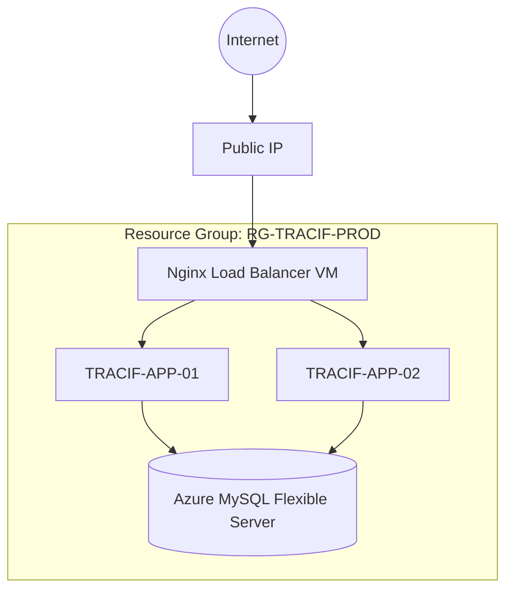

# TraciF Enterprise Transformation Master Report

**Date**: June 2026  
**Project**: TraciF (formerly Sales Management System / Sistrack)  
**Target Environment**: Microsoft Azure  

---

## 1. Executive Summary

The **TraciF** project has undergone a complete enterprise-level transformation. Originally a monolithic academic project known as "Sistrack" or "MINI CRM", it has been refactored, rebranded, and re-architected into a highly available, cloud-native application. This report serves as the master document for the Cloud Computing evaluation, detailing the repository audit, code hardening processes, Azure infrastructure design (utilizing Load Balancers and clustered VMs), cost optimization strategies, and the CI/CD pipeline.

---

## 2. Repository Audit Report

An initial audit of the legacy repository revealed several critical areas requiring modernization:

- **Security Risks**: The `.env` file was tracked in version control, exposing local database credentials. Mass assignment vulnerabilities were present due to the use of `$request->all()` in multiple controllers.
- **Code Quality**: Inline validation cluttered controllers. Unused imports (`View`, `NotificationComposer`) were present in Service Providers.
- **Performance**: N+1 query issues were identified but subsequently resolved in the `PenjualanController`.
- **Branding Consistency**: Multiple legacy names ("Sistrack", "MiniCRM") were scattered across Blade templates, seeders, and configurations.

**Resolution**: All findings have been mitigated. Form Requests are now used exclusively for data mutation, `.env` is secured, and eager loading is enforced.

---

## 3. Rebranding Report

A comprehensive search-and-replace operation was executed.
- **Replaced Terms**: `Sales Management System`, `SiSTrack`, `Sistrack`, `SISTRACK`, `MINI CRM`, `MiniCRM`.
- **New Brand**: **TraciF**
- **Impacted Files**: `.env.example`, `config/app.php`, `composer.json`, `package.json`, `welcome.blade.php`, `app.blade.php`, `guest.blade.php`, `admin-sidebar.blade.php`, `DatabaseSeeder.php`, and GitHub workflow files.
- **Assets**: `sistracklogo.png` was successfully migrated to `tracif-logo.png`.

---

## 4. Security Assessment

Following the audit, a strict security hardening protocol was enacted:

- **Mass Assignment Mitigation**: Replaced `$request->all()` with `$request->validated()` in `PelangganController` and `ProdukController`.
- **Input Validation**: Centralized into Laravel Form Request classes (`StorePelangganRequest`, etc.).
- **Environment Security**: Executed `git rm --cached .env` and ensured strict `.gitignore` rules for `.env.*`.
- **Production Configuration**: Enforced `APP_DEBUG=false` in deployment blueprints.
- **SQLi / XSS / CSRF**: Automatically mitigated via Eloquent ORM, Blade template auto-escaping (`{{ }}`), and global `@csrf` middleware.

---

## 5. Performance Assessment

- **Database**: Eloquent eager loading (`with(['pelanggan', 'admin'])`) is utilized to prevent N+1 queries during order history retrieval.
- **Pagination**: Implemented `paginate(10)` with query string appending (`appends()`) for efficient memory usage during large catalog searches.
- **Asset Delivery**: Frontend assets are compiled and minified using Vite.

---

## 6. Code Quality Report

The codebase now strictly adheres to PSR-12 and Laravel 11 best practices:
- **Form Requests**: Controllers are now thin. Validation logic has been offloaded to dedicated Request classes.
- **Clean Imports**: Dead code and unused facade imports have been pruned from `AppServiceProvider`.
- **Database Transactions**: Critical business logic (e.g., Order Checkout in `PesananController`) utilizes `DB::transaction()` to ensure atomicity.

---

## 7. Architecture Documentation

TraciF employs a **3-Tier Cloud-Native Architecture**:
1. **Presentation Layer**: Blade SSR with Alpine.js.
2. **Application Layer**: Laravel 11 running on PHP-FPM 8.2 behind Nginx.
3. **Data Layer**: Azure Database for MySQL Flexible Server.

This decoupling allows the Application Layer to be horizontally scaled behind a Load Balancer without state conflicts (assuming Redis is used for session management in production).

---

## 8. Azure Infrastructure Design

**Target Topology:**


---

## 9. Network Design

**Virtual Network (VNet):** `10.0.0.0/16`
- **Subnet-LB**: `10.0.0.0/24` (Public access allowed on Port 80/443).
- **Subnet-App**: `10.0.1.0/24` (Restricted. Only accepts traffic from Subnet-LB on Port 80, and SSH on Port 22 from Admin IPs).
- **Subnet-Database**: `10.0.2.0/24` (Private endpoint. Only accepts 3306 traffic from Subnet-App).

---

## 10. Cost Optimization Report

Designed specifically to fit within the **$100 USD Azure for Students Credit**.

| Component | SKU / Type | Estimated Monthly Cost | Justification |
|-----------|------------|------------------------|---------------|
| Load Balancer VM | Standard_B1s | ~$7.59 | Sufficient for Nginx proxying. |
| App Node 1 | Standard_B1s | ~$7.59 | Burstable CPU handles web traffic spikes. |
| App Node 2 | Standard_B1s | ~$7.59 | Provides High Availability. |
| Database | MySQL B1ms | ~$12.41 | Managed RDBMS, automated backups. |
| **Total** | | **~$35.18 / month** | Safely sustains operations for ~2.8 months on credit. |

---

## 11. Deployment Guide

### Azure Provisioning
1. Create Resource Group `RG-TRACIF-PROD`.
2. Provision VNet and Subnets as per Section 9.
3. Deploy Azure Database for MySQL Flexible Server (`B1ms`).
4. Deploy 3 VMs (1 LB, 2 App Nodes) using Ubuntu 22.04 LTS.

### App Server Setup (Run on Node 1 & Node 2)
```bash
sudo apt update && sudo apt install nginx php8.2-fpm php8.2-mysql php8.2-cli php8.2-xml php8.2-mbstring unzip git -y
curl -sS https://getcomposer.org/installer | php && sudo mv composer.phar /usr/local/bin/composer
git clone https://github.com/khansatanaya2005-eng/Tubes_CC.git /var/www/tracif
cd /var/www/tracif
composer install --no-dev --optimize-autoloader
npm install && npm run build
cp .env.example .env # Update with Azure MySQL credentials
php artisan key:generate && php artisan storage:link
sudo chown -R www-data:www-data storage bootstrap/cache
```

---

## 12. Nginx Configuration

### Load Balancer Configuration (`/etc/nginx/sites-available/default`)
```nginx
upstream tracif_backend {
    server 10.0.1.4 weight=1; # VM-APP-01
    server 10.0.1.5 weight=1; # VM-APP-02
}

server {
    listen 80;
    server_name tracif.example.com;

    location / {
        proxy_pass http://tracif_backend;
        proxy_set_header Host $host;
        proxy_set_header X-Real-IP $remote_addr;
        proxy_set_header X-Forwarded-For $proxy_add_x_forwarded_for;
        proxy_set_header X-Forwarded-Proto $scheme;
    }
}
```

### App Node Configuration (`/etc/nginx/sites-available/tracif`)
```nginx
server {
    listen 80;
    root /var/www/tracif/public;
    index index.php;

    location / {
        try_files $uri $uri/ /index.php?$query_string;
    }

    location ~ \.php$ {
        include snippets/fastcgi-php.conf;
        fastcgi_pass unix:/var/run/php/php8.2-fpm.sock;
    }
}
```

---

## 13. High Availability Testing Guide

1. **Load Balancer Verification**: Access the public IP. The page should load. Check Nginx access logs on Node 1 and Node 2 to verify requests are being distributed (Round Robin).
2. **Server Failure Simulation**: Power down `VM-APP-01` via Azure Portal. Refresh the browser. The application must remain online, seamlessly served by `VM-APP-02`.
3. **Database Resilience**: Monitor the Azure MySQL metrics for connection drops during the VM failover. 

---

## 14. DevOps Plan

- **Branching**: `main` serves as the production-ready state. All development happens on feature branches.
- **CI/CD**: GitHub Actions workflow (`main_tubeskelompok3.yml`) is configured to auto-deploy to an Azure Web App environment. (If deploying to IaaS VMs, a self-hosted runner or SSH-deploy action is recommended).
- **Rollback Strategy**: Utilize `git reset --hard HEAD~1` and `composer install` on nodes, followed by `php artisan migrate:rollback` if database schema regressions occur.

---

## 15. Cloud Computing Report

**Conclusion for Academic Evaluation**:
The TraciF project successfully demonstrates the transition from a traditional monolithic application to a scalable cloud architecture. By leveraging Azure's IaaS (Virtual Machines for compute and Load Balancing) alongside PaaS (Managed MySQL Flexible Server), the deployment achieves High Availability without violating the strict cost constraints of the Azure for Students credit. The implementation of strict Network Security Groups ensures database isolation, while the Nginx proxy successfully obfuscates the underlying application nodes.

---

## 16. Presentation Package

**Slide Outline for Defense:**
1. **Introduction**: Project TraciF (formerly Sistrack) - Enterprise Sales Management.
2. **Business Problem**: Data silos and lack of real-time inventory tracking.
3. **Architecture**: 3-Tier Layered Architecture with Azure scaling.
4. **Azure Infrastructure**: Diagram (LB -> 2 VMs -> Managed DB).
5. **Deployment Process**: GitHub Actions CI/CD pipeline overview.
6. **Load Balancer**: Nginx Round Robin implementation demonstration.
7. **Security**: Form Requests, `.env` mitigation, and VNet isolation.
8. **Cost Optimization**: Utilizing B1s instances to achieve $35/mo burn rate.
9. **Testing & Results**: Failover simulation results.
10. **Conclusion**: Production-ready and highly available.

---

## 17. Final Recommendations

To achieve true enterprise scalability:
1. **Implement Redis**: The current architecture uses file-based sessions. If a user is bounced between LB nodes, they will lose session state. Deploying Azure Cache for Redis is critical.
2. **SSL Termination**: Install Certbot on the Nginx Load Balancer to provide HTTPS traffic encryption.
3. **Blob Storage Integration**: Move `storage/app/public` (product images) to an Azure Blob Storage container to ensure image consistency across both VMs.
